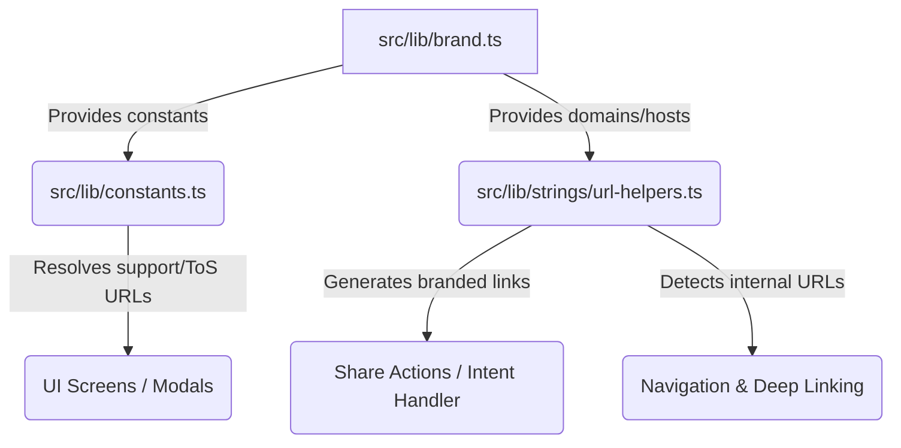

# Architecture Design Note: Centralized Brand Configuration System

## 1. Problem Statement & Rationale
CoSeeker is a downstream fork of the Bluesky social application. In a long-lived fork, the primary architectural challenge is **upstream merge maintainability**. 

Historically, user-facing branding (the app name "Bluesky", deep-link domains like `bsky.app`, and support/ToS/privacy URLs) was hardcoded directly inside various components, routing mechanisms, and string helpers. 

If we manually rename these values across hundreds of files, we introduce:
1. **High Regression Risk**: Inadvertently changing protocol-level endpoints (e.g., AT Protocol AppView/PDS requests) which must continue communicating with Bluesky networks.
2. **Merge Conflicts**: Every downstream merge from upstream (`bluesky-social/social-app`) would trigger massive conflicts, making updates difficult and error-prone.
3. **Branding Inconsistency**: Updating details like support desk links or ToS locations requires scanning the entire codebase.

---

## 2. Proposed Architecture & System Design
To solve these challenges, we introduced a centralized **Brand Configuration System**. This separates the brand representation layer from both the application logic and the underlying protocol implementation.



### Key Modules
1. **`src/lib/brand.ts`**: The single source of truth for all branding variables:
   - `BRAND_NAME` (`"CoSeeker"`)
   - `BRAND_DOMAIN` (`"coseeker.org"`)
   - `BRAND_HOST` (`"https://coseeker.org"`)
   - `BRAND_URLS` (TOS, Privacy, Support, Download links)
2. **`src/lib/constants.ts`**: Updated to consume values from `brand.ts` for user-facing links, keeping protocol-specific endpoints intact.
3. **`src/lib/strings/url-helpers.ts`**: Refactored to dynamically handle share link generation and deep link routing using the configured brand host while maintaining backward compatibility with `bsky.app`.

---

## 3. Implementation Details & Integration (Issue #40)
As a validation of the design, we resolved **Issue #40: Share links of a post have bsky.app URL** using the Brand Config System:
* **Branded URL Prepending**: Updated `toShareUrl()` and `BSKY_APP_HOST` to use `BRAND_HOST`. Relative paths shared by users now resolve to `https://coseeker.org/profile/...` instead of `https://bsky.app/profile/...`.
* **Deep Linking & Internal Routing**:
  - React Navigation's `LINKING` config prefix list was extended to include `BRAND_HOST`.
  - `isBskyAppUrl()` was updated to recognize `coseeker.org` URLs as internal links:
    ```typescript
    export function isBskyAppUrl(url: string): boolean {
      return url.startsWith('https://bsky.app/') || url.startsWith(`${BRAND_HOST}/`)
    }
    ```
  - Because `isBskyPostUrl`, `isBskyCustomFeedUrl`, and other checks delegate to `isBskyAppUrl`, the app now natively recognizes and routes `coseeker.org` deep links internally without opening them in external browsers.

---

## 4. Tradeoffs Considered

### Runtime Config vs. Static Code Constants
* **Static Constants (Chosen)**: We declared branding variables as strongly-typed static constants. This enables complete tree-shaking, static validation via TypeScript, and zero runtime performance overhead.
* **Dynamic Context/Hook**: A React Context provider could load branding from a remote endpoint. While more flexible, it introduces initialization delay, loading state complexities in deep-linking handlers, and overhead in utility functions that run outside the React render tree.

### Scope of Migration: Complete Search-and-Replace vs. Targeted Decoupling
* **Targeted Decoupling (Chosen)**: We migrated the core configuration, navigation, sharing helpers, and major onboarding screens (Welcome, Birthdate Settings).
* **Complete Search-and-Replace**: Avoided modifying every occurrence of the string "Bluesky" in internal comments, tests, and protocol assets. This minimizes upstream merge friction, ensuring that upstream changes to protocol code merge cleanly.

---

## 5. Future Extensions & Open Questions
1. **Branding Assets Pipeline**: The next logical step is to map asset resources (logos, App Icons, and splash screens) to a similar branding file so that asset assets are swapped automatically.
2. **Dynamic Server Config**: If CoSeeker transitions to a dedicated public PDS array in the future, the default host provider configuration (`DEFAULT_SERVICE`) can be integrated into `brand.ts`.
